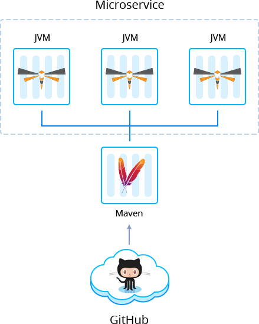

 

# Thorntail (WildFly Swarm) Framework

The [Thorntail](https://docs.thorntail.io/) is a framework, developed to create small standalone microservice-based applications in MicroProfile compatible way. Being based on the popular *WildFly Java* application server, the *Thorntail* is capable of producing so-called “just enough app-server” to support each component of your system.

Build and deploy your microservices automatically as:

- [Fat Jar](https://github.com/jelastic-jps/thorntail/tree/master/microservice-fat-jar) – Includes main classes, all required libraries, *Java EE* compatible runtimes / application servers.

- [Skinny Jar](https://github.com/jelastic-jps/thorntail/tree/master/microservice-skinny-jar) – Contains only the binary code of your applications without any library or runtime it depends on. It can’t be run autonomously, as it must be deployed into a prepackaged runtime container.
 
- [Thin War](https://github.com/vlobzakov/thorntail/blob/master) – Compiled and packaged application code/business logic together with 3rd party libraries which it depends on. It comes with drivers, frameworks, and utilities, etc. that are not the part of the standard *Java SE* or *Java EE* runtimes.

## Managed Hosting Business on Thorntail Microservices
To start offering this solution to your customers please follow to [Managed PaaS Hosting Business](https://jelastic.com/apaas/)
