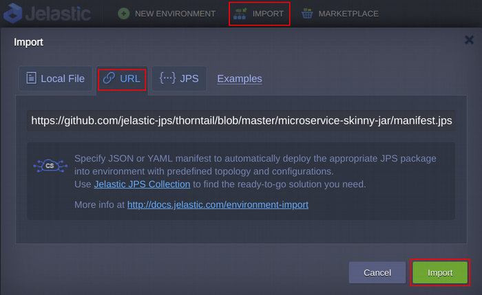
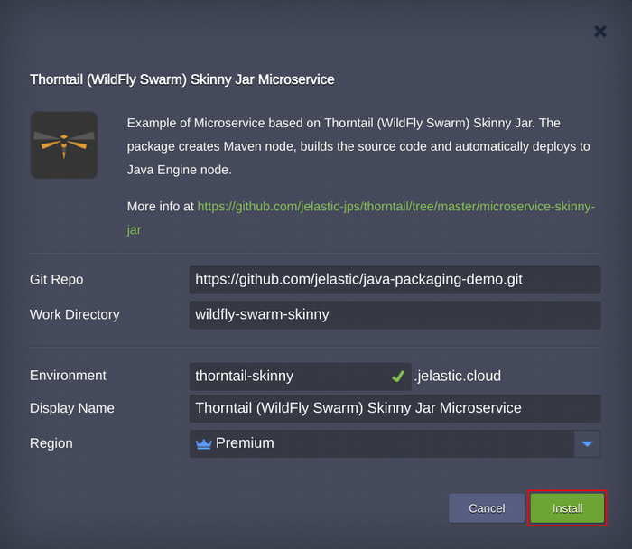
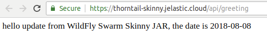

# Thorntail Skinny Jar Builder

Import the required manifest using the link from GitHub:
[https://github.com/jelastic-jps/thorntail/blob/master/microservice-skinny-jar/manifest.jps](https://github.com/jelastic-jps/thorntail/blob/master/microservice-skinny-jar/manifest.jps)

 

If required, change installation settings such as environment name or Git repository link to a custom Thorntail Skinny project. Then press *Install*.

 

Afterward, make sure that application is up and running by pressing *Open in browser* button. 

 

### Deploy Now

Press Deploy to get an account and deploy to a certified Jelastic partner from the distributed network of independent data center providers.

### Managed Hosting Business on Thorntail Skinny Based Microservices

To start offering this solution to your customers please follow to [Managed PaaS Hosting Business](https://jelastic.com/apaas/) 
